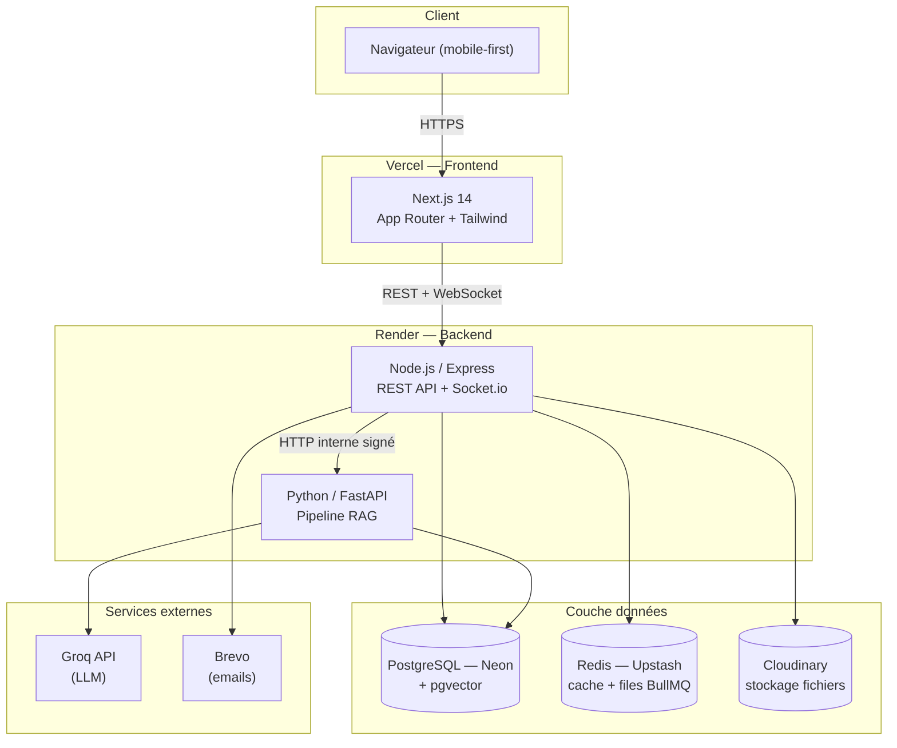

<div align="center">

# 🎓 EduSmart

### Plateforme de gestion scolaire intelligente

*Cours, emplois du temps, notes, communication et intelligence artificielle pédagogique
réunis dans une seule plateforme moderne, temps réel et mobile-first.*

[](backend)
[](frontend)
[](ai-service)
[-4169E1?logo=postgresql&logoColor=white)](#architecture)
[](#licence)

[Démo locale](#installation-locale) · [Documentation API](backend/docs/API.md) · [Guide de contribution](CONTRIBUTING.md)

</div>

---

## Sommaire

- [À propos](#à-propos)
- [Fonctionnalités](#fonctionnalités)
- [Architecture](#architecture)
  - [Stack technique](#stack-technique)
  - [Schéma d'architecture](#schéma-darchitecture)
  - [Modèle de données](#modèle-de-données)
- [Structure du dépôt](#structure-du-dépôt)
- [Prérequis](#prérequis)
- [Installation locale](#installation-locale)
  - [1. Cloner et configurer](#1-cloner-et-configurer)
  - [2. Base de données (Neon + pgvector)](#2-base-de-données-neon--pgvector)
  - [3. Backend Node.js](#3-backend-nodejs)
  - [4. Service IA Python](#4-service-ia-python)
  - [5. Frontend Next.js](#5-frontend-nextjs)
  - [6. Tout lancer en une commande](#6-tout-lancer-en-une-commande)
- [Variables d'environnement](#variables-denvironnement)
- [Tests](#tests)
- [Déploiement en production](#déploiement-en-production)
  - [Backend & Service IA sur Render](#backend--service-ia-sur-render)
  - [Frontend sur Vercel](#frontend-sur-vercel)
  - [CI/CD](#cicd)
- [Sécurité](#sécurité)
- [Équipe & contribution](#équipe--contribution)
- [Documentation complémentaire](#documentation-complémentaire)
- [Licence](#licence)

---

## À propos

**EduSmart** est une plateforme numérique unifiée destinée aux établissements
d'enseignement supérieur. Elle centralise l'ensemble du cycle pédagogique — diffusion
des supports de cours, gestion de l'emploi du temps, saisie et validation des notes,
génération des documents officiels — en intégrant un pipeline **RAG (Retrieval
Augmented Generation)** qui transforme les cours déposés par les enseignants en un
assistant pédagogique conversationnel, un moteur de recherche sémantique et un
générateur de fiches de révision.

Le projet répond au cahier des charges et au cahier de conception **EduSmart** (École
Nationale Supérieure Polytechnique de Yaoundé) couvrant **22 cas d'utilisation** répartis
en 7 domaines fonctionnels : Authentification, Gestion des cours, Emploi du temps,
Évaluation, Intelligence Artificielle, Communication et Statistiques.

## Fonctionnalités

| Domaine | Fonctionnalités |
|---|---|
| 🔐 **Authentification** | Connexion JWT (access 24h + refresh 30j rotatif), verrouillage après 5 échecs, réinitialisation de mot de passe |
| 📚 **Cours** | Dépôt de supports (PDF/PPTX/DOCX, 50 Mo max), téléchargement par URL signée, indexation RAG automatique |
| 🗓️ **Emploi du temps** | Consultation par filière/enseignant, gestion admin avec **détection automatique de conflits** (salle/enseignant) |
| 📝 **Évaluation** | Saisie de notes (grille enseignant), validation/refus par l'administration, calcul de moyennes pondérées et classement, génération de bulletins et PV de délibération en PDF |
| 🤖 **Intelligence Artificielle** | Chatbot RAG sourcé, recherche sémantique, génération de fiches de révision/résumés/quiz QCM (Groq LLM + embeddings locaux) |
| 📢 **Communication** | Annonces ciblées (filière/module/étudiant), messagerie temps réel par canal de module (Socket.io), notifications push + email |
| 📊 **Statistiques** | Tableaux de bord (taux de réussite, moyennes, activité plateforme), export CSV/PDF |
| 👥 **Administration** | Gestion des utilisateurs et structures académiques (filières/modules/matières/salles), audit complet des actions sensibles |

## Architecture

### Stack technique

| Couche | Technologies | Hébergement |
|---|---|---|
| **Frontend** | Next.js 14 (App Router) · TypeScript · Tailwind CSS · shadcn/ui · Zustand · React Query v5 · Socket.io-client · Framer Motion | Vercel |
| **Backend** | Node.js 20 · Express · TypeScript · Prisma ORM · Socket.io (+ adaptateur Redis) · Zod · BullMQ | Render |
| **Service IA** | Python 3.12 · FastAPI · sentence-transformers (embeddings) · Groq (LLM) · pgvector | Render |
| **Base de données** | PostgreSQL (Neon.tech) avec extension `pgvector` | Neon |
| **Cache & files** | Redis (Upstash) | Upstash |
| **Stockage fichiers** | Cloudinary (documents + avatars, URLs signées) | Cloudinary |
| **Emails** | Brevo (API transactionnelle) | Brevo |

### Schéma d'architecture



### Modèle de données

Le schéma complet (25 tables, 11 enums) est défini dans
[`backend/prisma/schema.prisma`](backend/prisma/schema.prisma) — source unique de
vérité, appliquée via les migrations versionnées dans `backend/prisma/migrations/`.
Points clés :

- Héritage par jointure `Utilisateur` → `Etudiant` / `Enseignant` / `AdminScolaire`.
- `document_chunk.embedding` : colonne `vector(384)` (pgvector), indexée en **HNSW**
  pour la recherche de similarité cosinus, écrite/lue par le service IA.
- `audit_log` : traçabilité de toute action sensible (création/modification/suppression,
  validations de notes, gestion des comptes).

## Structure du dépôt

Monorepo à 3 applications indépendantes, déployées séparément :

```
edusmart/
├── backend/            # API Node.js/Express/TypeScript — déployé sur Render
│   ├── src/
│   │   ├── modules/    # auth, admin, structures, cours, edt, notes, bulletins,
│   │   │                 annonces, messagerie, notifications, stats, ia
│   │   ├── middlewares/, sockets/, jobs/, utils/, config/
│   ├── prisma/         # schema.prisma + migrations
│   ├── docs/
│   │   └── API.md       # référence complète des endpoints REST + événements Socket.io
│   └── tests/           # Jest (règles métier critiques)
├── ai-service/          # Service IA Python/FastAPI — déployé sur Render
│   ├── app/
│   │   ├── routers/    # index, chat, search, fiche
│   │   ├── services/   # chunking, embeddings, vectorstore, groq_client, rag
│   └── tests/          # pytest
├── frontend/            # Application Next.js — déployée sur Vercel
│   └── src/
│       ├── app/         # routes par rôle : etudiant/, enseignant/, admin/
│       ├── components/  # ui/ (design system), layout/, shared/
│       ├── lib/, hooks/, types/
├── .github/workflows/   # CI (lint + build + tests, 3 jobs)
├── render.yaml           # configuration des 2 services Render
├── CONTRIBUTING.md        # workflow Git + fiches de tâches de l'équipe
└── README.md              # ce fichier
```

## Prérequis

- [Node.js 20+](https://nodejs.org/) et npm
- [Python 3.12+](https://www.python.org/)
- Un compte sur chacun des services suivants (offres gratuites suffisantes pour le
  développement) :
  - [Neon.tech](https://neon.tech) (PostgreSQL + pgvector)
  - [Upstash](https://upstash.com) (Redis)
  - [Cloudinary](https://cloudinary.com)
  - [Groq](https://console.groq.com) (clé API LLM)
  - [Brevo](https://www.brevo.com) (clé API emails)

## Installation locale

### 1. Cloner et configurer

```bash
git clone <url-du-dépôt> edusmart
cd edusmart
```

Chaque application a son propre fichier d'environnement. Copiez les modèles et
renseignez vos clés réelles :

```bash
cp backend/.env.example backend/.env
cp ai-service/.env.example ai-service/.env
cp frontend/.env.example frontend/.env.local
```

> ⚠️ Ne committez **jamais** un fichier `.env*` réel — ils sont exclus via
> `.gitignore`. Voir la section [Variables d'environnement](#variables-denvironnement)
> pour le détail de chaque clé.

### 2. Base de données (Neon + pgvector)

1. Créez un projet sur [neon.tech](https://neon.tech), copiez la chaîne de connexion
   (pooled) dans `DATABASE_URL` et la connexion directe dans `DIRECT_URL` de
   `backend/.env` **et** `DATABASE_URL` de `ai-service/.env`.
2. Appliquez le schéma (l'extension `pgvector` est créée automatiquement par la
   migration) :
   ```bash
   cd backend
   npm install
   npx prisma migrate deploy   # applique toutes les migrations versionnées
   npm run db:seed             # crée un compte de démo par rôle (voir sortie console)
   ```

### 3. Backend Node.js

```bash
cd backend
npm install
npm run dev      # http://localhost:4000 — tsx watch, rechargement à chaud
```

Vérification : `curl http://localhost:4000/api/health` doit répondre `{"success":true,...}`.

### 4. Service IA Python

```bash
cd ai-service
python -m venv venv
./venv/Scripts/activate        # Windows : venv\Scripts\activate — macOS/Linux : source venv/bin/activate
pip install -r requirements.txt --extra-index-url https://download.pytorch.org/whl/cpu
uvicorn app.main:app --reload --port 8000
```

Le premier démarrage télécharge le modèle d'embeddings (`all-MiniLM-L6-v2`, ~90 Mo) —
nécessite une connexion internet. Vérification : `curl http://localhost:8000/health`.

### 5. Frontend Next.js

```bash
cd frontend
npm install
npm run dev       # http://localhost:3000
```

Connectez-vous avec l'un des comptes créés par `npm run db:seed` (backend), par
exemple `admin@edusmart.test` / `EduSmart#2025`.

### 6. Tout lancer en une commande

Depuis la racine du monorepo, un script `concurrently` démarre les 3 services
ensemble (utile en développement quotidien, une fois chaque `.env` configuré) :

```bash
npm install        # installe concurrently à la racine
npm run dev          # backend + frontend + service IA en parallèle, logs préfixés
```

## Variables d'environnement

Le détail exhaustif de chaque variable (avec commentaires) est dans les fichiers
`*.env.example` de chaque application. Résumé :

<details>
<summary><strong>backend/.env</strong></summary>

| Variable | Description |
|---|---|
| `DATABASE_URL`, `DIRECT_URL` | Connexions Neon Postgres (pooled / directe) |
| `REDIS_URL` | Connexion Upstash Redis (`rediss://...`) |
| `JWT_ACCESS_SECRET`, `JWT_REFRESH_SECRET` | Secrets JWT (32+ caractères) |
| `CLOUDINARY_CLOUD_NAME/API_KEY/API_SECRET` | Identifiants Cloudinary |
| `BREVO_API_KEY`, `BREVO_SENDER_EMAIL` | Envoi d'emails transactionnels |
| `AI_SERVICE_URL`, `AI_SERVICE_SECRET` | URL + secret partagé avec le service IA |
| `FRONTEND_URL`, `CORS_ALLOWED_ORIGINS` | Origine(s) autorisée(s) pour le CORS |
| `MAX_LOGIN_ATTEMPTS`, `LOCKOUT_DURATION_MINUTES` | Politique de verrouillage de compte |
| `ETABLISSEMENT_NOM`, `SEUIL_ADMISSION` | Personnalisation des documents officiels |

</details>

<details>
<summary><strong>ai-service/.env</strong></summary>

| Variable | Description |
|---|---|
| `DATABASE_URL` | Même base Neon que le backend (accès direct pgvector) |
| `INTERNAL_SECRET` | Doit être **identique** à `AI_SERVICE_SECRET` du backend |
| `BACKEND_URL` | URL du backend (callback de fin de génération de fiche) |
| `GROQ_API_KEY`, `GROQ_MODEL` | Clé et modèle LLM Groq |
| `EMBEDDING_MODEL`, `EMBEDDING_DIMENSIONS` | Modèle d'embeddings (doit matcher `vector(384)`) |
| `RAG_TOP_K`, `RAG_SIMILARITY_THRESHOLD` | Paramètres de recherche vectorielle |

</details>

<details>
<summary><strong>frontend/.env.local</strong></summary>

| Variable | Description |
|---|---|
| `NEXT_PUBLIC_BACKEND_URL` | URL publique du backend (API REST) |
| `NEXT_PUBLIC_SOCKET_URL` | URL du serveur Socket.io (= backend) |

</details>

## Tests

```bash
# Backend — Jest (règles métier critiques : moyennes, conflits EDT, verrouillage compte)
cd backend && npm test

# Service IA — pytest (chunking, parsing)
cd ai-service && pytest

# Frontend — build de production (type-check + lint inclus)
cd frontend && npm run build
```

La CI GitHub Actions ([.github/workflows/ci.yml](.github/workflows/ci.yml)) exécute
ces trois suites sur chaque Pull Request vers `develop`/`main`.

## Déploiement en production

### Backend & Service IA sur Render

Le fichier [`render.yaml`](render.yaml) décrit les deux services en *Blueprint* Render.

1. Sur [render.com](https://render.com), **New → Blueprint**, sélectionnez ce dépôt.
2. Render détecte `render.yaml` et propose de créer `edusmart-backend` (Node,
   `rootDir: backend`) et `edusmart-ai-service` (Python, `rootDir: ai-service`).
3. Renseignez les variables marquées `sync: false` dans le dashboard Render pour
   **chaque** service (valeurs réelles de Neon/Upstash/Cloudinary/Brevo/Groq).
4. Une fois les deux services déployés une première fois, complétez les références
   croisées :
   - `edusmart-backend` → `AI_SERVICE_URL` = URL publique de `edusmart-ai-service`
   - `edusmart-ai-service` → `BACKEND_URL` = URL publique de `edusmart-backend`
   - `AI_SERVICE_SECRET` (backend) doit être **identique** à `INTERNAL_SECRET` (IA)
5. Redéployez les deux services pour prendre en compte ces URLs.

> **Déploiement 100% gratuit.** Les deux services utilisent le plan **Free** de Render
> (`plan: free` dans `render.yaml`) — aucun coût. Deux compromis à connaître :
> - **Mise en veille** : un service gratuit s'endort après 15 min sans requête et met
>   ~1 minute à se réveiller au prochain appel. Avant une démo, ouvrez les deux URLs
>   (`/api/health` et `/health`) quelques minutes à l'avance pour les "réveiller".
> - **Mémoire** : le service IA charge un modèle d'embeddings en mémoire (~335 Mo
>   mesurés en local) sur les 512 Mo du plan gratuit — c'est suffisant en usage normal
>   mais sans grande marge. `OMP_NUM_THREADS=1` et `torch.set_num_threads(1)` sont déjà
>   configurés pour limiter la surcharge. ⚠️ Le plan **Starter** a exactement la **même
>   RAM (512 Mo)** que Free — seul le CPU (0.5 vs 0.1 vCPU) et l'absence de mise en
>   veille changent. Seul le plan **Standard** (2 Go, payant) augmenterait réellement la
>   marge mémoire si des erreurs "Out of Memory" apparaissaient dans les logs Render.

### Frontend sur Vercel

1. Sur [vercel.com](https://vercel.com), **Add New → Project**, importez ce dépôt.
2. **Root Directory** : `frontend`.
3. Variables d'environnement (Project Settings → Environment Variables) :
   `NEXT_PUBLIC_BACKEND_URL` et `NEXT_PUBLIC_SOCKET_URL` = URL publique de
   `edusmart-backend` sur Render.
4. Déployez. Vercel détecte automatiquement Next.js (aucune configuration de build
   supplémentaire nécessaire au-delà de [`vercel.json`](frontend/vercel.json)).
5. Sur le backend Render, ajoutez l'URL Vercel à `CORS_ALLOWED_ORIGINS` et
   `FRONTEND_URL`, puis redéployez.

### CI/CD

- **Intégration continue** : chaque Pull Request déclenche lint + build + tests pour
  les 3 applications ([.github/workflows/ci.yml](.github/workflows/ci.yml)).
- **Déploiement continu** : Render et Vercel sont tous deux configurés en
  *auto-deploy* sur la branche `main` — un merge dans `main` déploie automatiquement
  les 3 services.

## Sécurité

- Mots de passe hachés avec **bcrypt** (coût 12), jamais stockés en clair.
- JWT **HS256** : access token 24h, refresh token 30j stocké en cookie `HttpOnly`
  + révocable côté serveur (rotation à chaque rafraîchissement).
- Verrouillage de compte après 5 tentatives échouées (15 minutes).
- RBAC strict par rôle sur chaque route (middleware `authorize`).
- Validation systématique des entrées (Zod) côté backend et service IA (Pydantic).
- En-têtes de sécurité (Helmet), CORS strict, rate limiting distribué (Redis).
- URLs de téléchargement de documents **signées et expirables** (15 minutes,
  Cloudinary `type: authenticated`).
- Audit complet (`audit_log`) de toute action sensible : qui, quoi, quand, avant/après.
- Communication service Node ↔ service IA authentifiée par secret partagé
  (`X-Internal-Secret`), jamais exposée au frontend.

## Équipe & contribution

Projet réalisé par une équipe de 3 — voir [CONTRIBUTING.md](CONTRIBUTING.md) pour le
détail de la répartition, le workflow Git (branches, commits, Pull Requests) et les
fiches de tâches assignées à chaque contributeur.

| Membre | Rôle |
|---|---|
| DIFFO KENNE Garnel | Chef de projet, Fullstack (backend, service IA, DevOps, majorité frontend) |
| MBIDA NGUELE Paul Loïc | Frontend — feature Annonces |
| MEZAGO Wilfried Aymar | Frontend — feature Messagerie temps réel |

## Documentation complémentaire

- [backend/docs/API.md](backend/docs/API.md) — référence complète des endpoints REST
  et des événements Socket.io.
- [CONTRIBUTING.md](CONTRIBUTING.md) — workflow Git et fiches de tâches.
- `backend/prisma/schema.prisma` — schéma de données commenté, source de vérité.

## Licence

Projet académique réalisé dans le cadre du cours de Génie Logiciel — École Nationale
Supérieure Polytechnique de Yaoundé, Université de Yaoundé I, Année académique
2025–2026.
