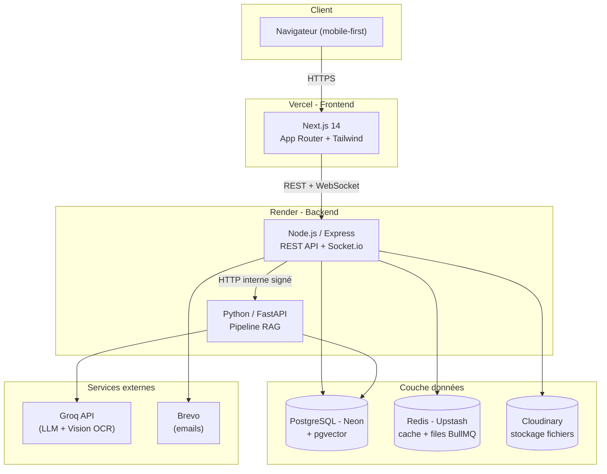

---

## Sommaire

- [À propos](#à-propos)
- [Fonctionnalités](#fonctionnalités)
- [Architecture](#architecture)
  - [Stack technique](#stack-technique)
  - [Schéma d&#39;architecture](#schéma-darchitecture)
  - [Modèle de données](#modèle-de-données)
- [Structure du dépôt](#structure-du-dépôt)
- [Prérequis](#prérequis)
- [Installation locale](#installation-locale)
  - [1. Cloner et configurer](#1-cloner-et-configurer)
  - [2. Base de données (Neon + pgvector)](#2-base-de-données-neon--pgvector)
  - [3. Backend Node.js](#3-backend-nodejs)
  - [4. Service IA Python](#4-service-ia-python)
  - [5. Frontend Next.js](#5-frontend-nextjs)
  - [6. Tout lancer en une commande](#6-tout-lancer-en-une-commande)
- [Variables d&#39;environnement](#variables-denvironnement)
- [Tests](#tests)
- [Déploiement en production](#déploiement-en-production)
  - [Backend &amp; Service IA sur Render](#backend--service-ia-sur-render)
  - [Frontend sur Vercel](#frontend-sur-vercel)
  - [CI/CD](#cicd)
- [Documentation technique détaillée](#documentation-technique-détaillée)
  - [Authentification et sécurité](#authentification-et-sécurité)
  - [Gestion des structures académiques](#gestion-des-structures-académiques)
  - [Gestion des utilisateurs](#gestion-des-utilisateurs)
  - [Cours et supports pédagogiques](#cours-et-supports-pédagogiques)
  - [Notes et évaluations](#notes-et-évaluations)
  - [Bulletins et PV de délibération](#bulletins-et-pv-de-délibération)
  - [Emploi du temps](#emploi-du-temps)
  - [Annonces](#annonces)
  - [Messagerie en temps réel](#messagerie-en-temps-réel)
  - [Notifications](#notifications)
  - [Pipeline RAG et Chatbot IA](#pipeline-rag-et-chatbot-ia)
  - [Recherche sémantique](#recherche-sémantique)
  - [Fiches de révision générées par IA](#fiches-de-révision-générées-par-ia)
  - [Documents personnels et OCR](#documents-personnels-et-ocr)
  - [Tableau de bord et statistiques](#tableau-de-bord-et-statistiques)
  - [Profil et paramètres utilisateur](#profil-et-paramètres-utilisateur)
  - [Temps réel - Socket.io](#temps-réel---socketio)
  - [File de tâches BullMQ](#file-de-tâches-bullmq)
  - [Génération de PDF](#génération-de-pdf)
  - [Stockage de fichiers - Cloudinary](#stockage-de-fichiers---cloudinary)
- [Sécurité](#sécurité)
- [Équipe &amp; contribution](#équipe--contribution)
- [Documentation complémentaire](#documentation-complémentaire)
- [Licence](#licence)

---

## À propos

**EduSmart** est une plateforme numérique unifiée destinée aux établissements
d'enseignement supérieur. Elle centralise l'ensemble du cycle pédagogique - diffusion
des supports de cours, gestion de l'emploi du temps, saisie et validation des notes,
génération des documents officiels - en intégrant un pipeline **RAG (Retrieval
Augmented Generation)** qui transforme les cours déposés par les enseignants en un
assistant pédagogique conversationnel, un moteur de recherche sémantique et un
générateur de fiches de révision.

Le projet répond au cahier des charges et au cahier de conception **EduSmart** (École
Nationale Supérieure Polytechnique de Yaoundé) couvrant **22 cas d'utilisation** répartis
en 7 domaines fonctionnels : Authentification, Gestion des cours, Emploi du temps,
Évaluation, Intelligence Artificielle, Communication et Statistiques.

## Fonctionnalités

| Domaine                               | Fonctionnalités                                                                                                                                                                   |
| ------------------------------------- | ---------------------------------------------------------------------------------------------------------------------------------------------------------------------------------- |
| 🔐 **Authentification**          | Connexion JWT (access 15 min + refresh 7j rotatif), verrouillage après 5 échecs, réinitialisation de mot de passe par email                                                    |
| 📚 **Cours**                     | Dépôt de supports (PDF/PPTX/DOCX, 50 Mo max), téléchargement par URL signée Cloudinary, indexation RAG automatique via BullMQ                                                |
| 🗓️ **Emploi du temps**         | Fichier image/PDF par filière + semestre, upload admin, consultation étudiant/enseignant, invalidation cache Redis, notification temps réel                                    |
| 📝 **Évaluation**               | Saisie de notes (grille enseignant par session), validation/refus par l'administration, calcul de moyennes pondérées et classement, génération de bulletins et PV en PDF       |
| 🤖 **Intelligence Artificielle** | Chatbot RAG sourcé, recherche sémantique, génération de fiches/résumés/quiz QCM, OCR via LLM multimodal pour documents personnels en image                                    |
| 📢 **Communication**             | Annonces ciblées (filière/module/étudiant) avec pièce jointe, messagerie temps réel par canal de module (Socket.io), notifications push + email via BullMQ + Brevo             |
| 📊 **Statistiques**              | Tableaux de bord avec graphiques (Recharts) réservés à l'administration et à la direction                                                                                        |
| 👥 **Administration**            | Gestion des utilisateurs et structures académiques (filières/modules/matières/salles), délégué de filière, audit complet des actions sensibles                                  |

## Architecture

### Stack technique

| Couche                      | Technologies                                                                                                                         | Hébergement |
| --------------------------- | ------------------------------------------------------------------------------------------------------------------------------------ | ------------ |
| **Frontend**          | Next.js 14 (App Router) · TypeScript · Tailwind CSS · shadcn/ui · Zustand · React Query v5 · Socket.io-client · Framer Motion | Vercel       |
| **Backend**           | Node.js 20 · Express · TypeScript · Prisma ORM · Socket.io (+ adaptateur Redis) · Zod · BullMQ                                 | Render       |
| **Service IA**        | Python 3.11+ · FastAPI · sentence-transformers (embeddings locaux) · Groq API (LLM + vision OCR) · asyncpg · pgvector           | Render       |
| **Base de données**  | PostgreSQL (Neon.tech) avec extension `pgvector`                                                                                   | Neon         |
| **Cache & files**     | Redis (Upstash)                                                                                                                      | Upstash      |
| **Stockage fichiers** | Cloudinary (documents + avatars, URLs signées)                                                                                      | Cloudinary   |
| **Emails**            | Brevo (API transactionnelle)                                                                                                         | Brevo        |

### Schéma d'architecture



**Règle d'isolation** : le frontend ne parle jamais directement au service IA Python. Toutes les requêtes IA passent par le backend Node.js, qui vérifie les autorisations JWT avant de relayer. Le service IA rappelle le backend via un callback HTTP authentifié par un secret partagé (`INTERNAL_SECRET`).

### Modèle de données

Le schéma complet (25+ tables, 11 enums) est défini dans
[`backend/prisma/schema.prisma`](backend/prisma/schema.prisma) - source unique de
vérité, appliquée via les migrations versionnées dans `backend/prisma/migrations/`.
Points clés :

- Héritage par jointure `Utilisateur` → `Etudiant` / `Enseignant` / `AdminScolaire`.
- `document_chunk.embedding` : colonne `vector(384)` (pgvector), recherche de similarité cosinus via opérateur `<=>`, requêtes en `$queryRaw` Prisma car type non supporté nativement.
- `document_personnel_chunk` : table miroir isolée pour les supports personnels des étudiants.
- `audit_log` : traçabilité de toute action sensible (qui, quoi, quand, avant/après, IP).

## Structure du dépôt

Monorepo à 3 applications indépendantes, déployées séparément :

```
edusmart/
├── backend/            # API Node.js/Express/TypeScript - déployé sur Render
│   ├── src/
│   │   ├── modules/    # auth, admin, structures, cours, edt, notes, bulletins,
│   │   │                 annonces, messagerie, notifications, stats, ia,
│   │   │                 documentsPersonnels
│   │   ├── middlewares/, sockets/, jobs/, utils/, config/
│   ├── prisma/         # schema.prisma + migrations
│   └── tests/          # Jest (règles métier critiques)
├── ai-service/          # Service IA Python/FastAPI - déployé sur Render
│   └── app/
│       ├── routers/    # index, index-personnel, chat, search, fiche
│       └── services/   # chunking, embeddings, vectorstore, groq_client,
│                         rag, document_extractor, callback
├── frontend/            # Application Next.js - déployée sur Vercel
│   └── src/
│       ├── app/         # routes par rôle : etudiant/, enseignant/, admin/
│       ├── components/  # ui/ (design system), layout/, shared/
│       ├── lib/, hooks/, types/
├── render.yaml           # configuration des 2 services Render
├── CONTRIBUTING.md
└── README.md
```

Chaque module backend suit le même pattern en **4 couches** :
- **`routes.ts`** : endpoints Express, middlewares (auth, autorisation, validation, upload)
- **`controller.ts`** : extraction des paramètres HTTP, appel du service, réponse JSON
- **`service.ts`** : logique métier, orchestration, règles de gestion
- **`repository.ts`** : requêtes Prisma/SQL uniquement, aucune logique métier

## Prérequis

- [Node.js 20+](https://nodejs.org/) et npm
- [Python 3.11+](https://www.python.org/)
- Un compte sur chacun des services suivants (offres gratuites suffisantes pour le développement) :
  - [Neon.tech](https://neon.tech) (PostgreSQL + pgvector)
  - [Upstash](https://upstash.com) (Redis)
  - [Cloudinary](https://cloudinary.com)
  - [Groq](https://console.groq.com) (clé API LLM)
  - [Brevo](https://www.brevo.com) (clé API emails)

## Installation locale

### 1. Cloner et configurer

```bash
git clone <url-du-dépôt> edusmart
cd edusmart
```

Chaque application a son propre fichier d'environnement. Copiez les modèles et
renseignez vos clés réelles :

```bash
cp backend/.env.example backend/.env
cp ai-service/.env.example ai-service/.env
cp frontend/.env.example frontend/.env.local
```

> Ne committez **jamais** un fichier `.env*` réel - ils sont exclus via `.gitignore`.

### 2. Base de données (Neon + pgvector)

1. Créez un projet sur [neon.tech](https://neon.tech), copiez la chaîne de connexion
   (pooled) dans `DATABASE_URL` et la connexion directe dans `DIRECT_URL` de
   `backend/.env` **et** `DATABASE_URL` de `ai-service/.env`.
2. Appliquez le schéma (l'extension `pgvector` est créée automatiquement par la migration) :
   ```bash
   cd backend
   npm install
   npx prisma migrate deploy
   npm run db:seed
   ```

### 3. Backend Node.js

```bash
cd backend
npm install
npm run dev      # http://localhost:4000 - tsx watch, rechargement à chaud
```

Vérification : `curl http://localhost:4000/api/health` doit répondre `{"success":true,...}`.

### 4. Service IA Python

```bash
cd ai-service
python -m venv venv
venv\Scripts\activate        # Windows : venv\Scripts\activate
pip install -r requirements.txt --extra-index-url https://download.pytorch.org/whl/cpu
uvicorn app.main:app --reload --port 8000
```

Le premier démarrage télécharge le modèle d'embeddings (`all-MiniLM-L6-v2`, ~90 Mo).
Vérification : `curl http://localhost:8000/health`.

### 5. Frontend Next.js

```bash
cd frontend
npm install
npm run dev       # http://localhost:3000
```

### 6. Tout lancer en une commande

```bash
# Depuis la racine du monorepo
npm install
npm run dev   # backend + frontend + service IA en parallèle, logs préfixés
```

**Comptes de démonstration** (créés par `npm run db:seed`) :

| Rôle | Email | Mot de passe |
|---|---|---|
| Super Admin | `admin@edusmart.test` | `EduSmart#2026` |
| Admin Scolaire | `scolaire@edusmart.test` | `EduSmart#2026` |
| Enseignant | `enseignant@edusmart.test` | `EduSmart#2026` |
| Étudiant | `etudiant@edusmart.test` | `EduSmart#2026` |

## Variables d'environnement

<details>
<summary><strong>backend/.env</strong></summary>

| Variable | Description |
| --- | --- |
| `DATABASE_URL`, `DIRECT_URL` | Connexions Neon Postgres (pooled / directe) |
| `REDIS_URL` | Connexion Upstash Redis (`rediss://...`) |
| `JWT_ACCESS_SECRET`, `JWT_REFRESH_SECRET` | Secrets JWT (32+ caractères) |
| `JWT_RESET_SECRET` | Secret pour les tokens de réinitialisation de MDP (1h) |
| `CLOUDINARY_CLOUD_NAME/API_KEY/API_SECRET` | Identifiants Cloudinary |
| `BREVO_API_KEY`, `EMAIL_FROM` | Envoi d'emails transactionnels |
| `AI_SERVICE_URL`, `INTERNAL_SECRET` | URL + secret partagé avec le service IA |
| `FRONTEND_URL`, `CORS_ALLOWED_ORIGINS` | Origine(s) autorisée(s) pour le CORS |
| `MAX_LOGIN_ATTEMPTS`, `LOCKOUT_DURATION_MINUTES` | Politique de verrouillage de compte |
| `ETABLISSEMENT_NOM`, `SEUIL_ADMISSION` | Personnalisation des documents officiels |

</details>

<details>
<summary><strong>ai-service/.env</strong></summary>

| Variable | Description |
| --- | --- |
| `DATABASE_URL` | Même base Neon que le backend (accès asyncpg direct pour pgvector) |
| `INTERNAL_SECRET` | Doit être **identique** à `INTERNAL_SECRET` du backend |
| `BACKEND_URL` | URL du backend (callback de fin d'indexation et de génération de fiche) |
| `GROQ_API_KEY` | Clé API Groq |
| `GROQ_MODEL` | Modèle LLM (défaut : `openai/gpt-oss-120b`) |
| `GROQ_VISION_MODEL` | Modèle multimodal OCR (défaut : `meta-llama/llama-4-scout-17b-16e-instruct`) |
| `EMBEDDING_MODEL` | Modèle d'embeddings (défaut : `sentence-transformers/all-MiniLM-L6-v2`) |
| `RAG_TOP_K` | Nombre de chunks à retourner (défaut : 5) |
| `RAG_SIMILARITY_THRESHOLD` | Seuil de similarité cosinus (défaut : 0.70) |
| `CHUNK_SIZE_CHARS` | Taille des chunks en caractères (défaut : 1000) |
| `CHUNK_OVERLAP_CHARS` | Chevauchement entre chunks (défaut : 150) |

</details>

<details>
<summary><strong>frontend/.env.local</strong></summary>

| Variable | Description |
| --- | --- |
| `NEXT_PUBLIC_BACKEND_URL` | URL publique du backend (API REST + WebSocket) |

</details>

## Tests

```bash
# Backend - Jest
cd backend && npm test

# Frontend - build de production (type-check + lint inclus)
cd frontend && npm run build
```

## Déploiement en production

### Backend & Service IA sur Render

Le fichier [`render.yaml`](render.yaml) décrit les deux services en Blueprint Render.

1. Sur [render.com](https://render.com), **New → Blueprint**, sélectionnez ce dépôt.
2. Render détecte `render.yaml` et propose de créer `edusmart-backend` (Node, `rootDir: backend`) et `edusmart-ai-service` (Python, `rootDir: ai-service`).
3. Renseignez les variables dans le dashboard Render pour chaque service.
4. Complétez les références croisées (`AI_SERVICE_URL` et `BACKEND_URL`) après le premier déploiement.

> **Plan gratuit Render** : les services s'endorment après 15 min sans requête (~1 min de réveil). Le service IA charge ~335 Mo en mémoire sur les 512 Mo disponibles.

### Frontend sur Vercel

1. Sur [vercel.com](https://vercel.com), **Add New → Project**, importez ce dépôt.
2. **Root Directory** : `frontend`.
3. Ajoutez `NEXT_PUBLIC_BACKEND_URL` = URL publique de `edusmart-backend`.
4. Ajoutez l'URL Vercel à `CORS_ALLOWED_ORIGINS` et `FRONTEND_URL` du backend.

### CI/CD

Render et Vercel sont configurés en auto-deploy sur la branche `main`. Un merge dans `main` déploie automatiquement les 3 services.

---

## Documentation technique détaillée

Cette section documente le fonctionnement interne de chaque fonctionnalité : flux de données, outils mobilisés, décisions d'implémentation.

---

### Authentification et sécurité

**Endpoints** : `POST /api/auth/login`, `POST /api/auth/refresh`, `POST /api/auth/logout`, `GET /api/auth/me`, `POST /api/auth/forgot-password`, `POST /api/auth/reset-password`, `POST /api/auth/change-password`  
**Module** : `backend/src/modules/auth/`

#### Double jeton JWT (Access + Refresh)

L'application utilise un système à deux jetons pour concilier sécurité et expérience utilisateur :

```
Connexion réussie
    │
    ├── Access Token JWT (HS256)
    │   - Durée : 15 minutes
    │   - Payload : { sub: userId, email, role }
    │   - Stocké : en mémoire JavaScript (Zustand store, jamais localStorage)
    │   - Envoyé : header Authorization: Bearer <token>
    │
    └── Refresh Token (UUID v4)
        - Durée : 7 jours
        - Haché SHA-256 avant stockage en base (table refresh_token)
        - Envoyé : cookie HttpOnly, SameSite=Strict (inaccessible depuis JS)
        - Révocable côté serveur
```

**Rotation automatique** : à chaque rafraîchissement, l'ancien refresh token est révoqué et un nouveau est émis. L'intercepteur Axios du frontend capte les réponses 401 (sauf `/auth/login` et `/auth/refresh`), appelle `/auth/refresh` silencieusement et retente la requête originale avec le nouveau token - sans que l'utilisateur voie quoi que ce soit.

#### Anti-brute-force

- `express-rate-limit` sur `POST /auth/login` : 10 tentatives / 15 min par IP
- Compteur `tentativesEchouees` en base : après 5 échecs consécutifs, `verrouilleJusquA` est mis à `now + LOCKOUT_DURATION_MINUTES`
- À la reconnexion réussie : compteur remis à 0, verrou levé

#### Réinitialisation de mot de passe

1. `POST /auth/forgot-password` : si l'email existe, un JWT spécial est signé avec `JWT_RESET_SECRET` (durée 1h) et l'URL `FRONTEND_URL/reset-password?token=...` est envoyée par email via **Brevo**. La réponse est identique que l'email existe ou non (pas de divulgation d'informations).
2. `POST /auth/reset-password` : vérifie et décode le token de réinitialisation, hache le nouveau mot de passe avec **bcrypt** (coût 12), révoque tous les refresh tokens de l'utilisateur.

#### Middlewares de protection

- **`authenticate`** : vérifie la signature JWT du header `Authorization: Bearer`, attache `req.user` (`{ id, email, role }`)
- **`authorize(...roles)`** : vérifie que `req.user.role` est dans la liste. Ex : `authorize('ADMIN_SCOLAIRE', 'SUPER_ADMIN')`
- **`validate({ body/query/params })`** : valide le payload avec un schéma Zod avant d'atteindre le contrôleur. Toute non-conformité retourne un 400 structuré.
- **`verifyInternalSecret`** : vérifie le header `x-internal-secret` pour les callbacks du service IA (pas de JWT utilisateur ici)

---

### Gestion des structures académiques

**Endpoints** : `GET|POST|PUT|DELETE /api/structures/filieres|modules|matieres|salles`  
**Module** : `backend/src/modules/structures/`  
**Page** : `frontend/src/app/admin/structures/page.tsx`

La hiérarchie académique suit un modèle à 3 niveaux :

```
Filière (ex: "AIA-4", niveau "4", cycle "Ingénieur", salle attitrée optionnelle)
  └── Module (ex: "Machine Learning", semestre 1, 6 crédits ECTS)
        └── Matière (ex: "Réseaux de neurones", coeff. 2, enseignant affecté)
```

**Filière** : possède un `code` unique, un `niveau` (texte libre, ex. "4"), un `cycle`, une description optionnelle et un `salleAttitreeId` optionnel. À la création, aucun canal de discussion n'est créé au niveau filière - les canaux sont par **module**.

**Module** : appartient à une filière et à un semestre (1 ou 2). À chaque création de module, un `CanalDiscussion` est automatiquement créé pour permettre la messagerie entre étudiants du module.

**Matière** : liée à un module et optionnellement à un enseignant (`enseignantId`). L'enseignant affecté est le seul autorisé à déposer des cours et à saisir des notes pour cette matière (vérification dans `cours.service` et `notes.service`).

**Salle** : type (`AMPHITHEATRE`, `LABO`, `SALLE_COURS`), capacité, bâtiment. Peut être associée à une filière comme "salle attitrée".

Toutes les opérations de modification sont réservées à `ADMIN_SCOLAIRE` / `SUPER_ADMIN`. La lecture est ouverte à tous les rôles authentifiés (le frontend filtre selon le contexte).

---

### Gestion des utilisateurs

**Endpoints** : `GET|POST|PUT /api/admin/utilisateurs`, `PUT /api/admin/utilisateurs/:id/delegue`  
**Module** : `backend/src/modules/admin/`  
**Page** : `frontend/src/app/admin/utilisateurs/page.tsx`

#### Création d'un compte

Lorsque l'admin crée un étudiant, le backend effectue les opérations suivantes dans une transaction :
1. Génère un mot de passe temporaire
2. Crée l'enregistrement `Utilisateur` avec le hash bcrypt
3. Crée l'enregistrement `Etudiant` (matricule, `anneeEntree`, `estDelegue: false`)
4. Crée automatiquement une `Inscription` avec `statut: 'ACTIVE'` pour la filière et l'année scolaire courante
5. Envoie un email avec le mot de passe temporaire via Brevo

#### Modification et changement de mot de passe

Le payload Zod du PUT peut contenir `nouveauMotDePasse`. Ce champ est extrait du payload avant l'appel à `adminRepository.update()` :
```typescript
const { nouveauMotDePasse, ...champsBruts } = input;
const dataUpdate = { ...champsBruts };
if (nouveauMotDePasse) {
  dataUpdate.motDePasseHash = await hashPassword(nouveauMotDePasse);
}
await adminRepository.update(id, dataUpdate);
```
Cela évite de passer un mot de passe en clair au repository Prisma.

#### Vue des utilisateurs (frontend)

- Filtre par rôle : lorsque `roleFiltre === 'ETUDIANT'`, un filtre filière supplémentaire apparaît
- Tri et regroupement côté client : les étudiants sont triés par filière active puis par nom, affichés avec un en-tête de groupe par filière
- L'inscription active d'un étudiant est chargée via une jointure dans `adminRepository.list()` (`include: { etudiant: { include: { inscriptions: { filiere: true } } } }`)
- Le délégué de chaque filière est signalé visuellement (icône couronne)

#### Délégué de filière

`PUT /api/admin/utilisateurs/:id/delegue` : toggle `Etudiant.estDelegue`. Ce n'est pas un rôle RBAC distinct - la vérification se fait dans `annonces.service` lors de la publication. Un audit est enregistré.

---

### Cours et supports pédagogiques

**Endpoints** : `GET /api/cours`, `GET /api/cours/:id/download`, `POST /api/cours/upload`  
**Module** : `backend/src/modules/cours/`  
**Pages** : `enseignant/cours/page.tsx`, `etudiant/cours/page.tsx`

#### Dépôt d'un cours (enseignant)

```
POST /api/cours/upload (multipart/form-data)
     │
     ▼
1. Multer reçoit le fichier en mémoire RAM (pas d'écriture disque)
   - Formats acceptés : PDF, PPTX, DOCX (50 Mo max)
   - Multer est configuré avec memoryStorage()
     │
     ▼
2. Vérification d'autorisation
   - L'enseignant doit être affecté à la matière cible (matiere.enseignantId === user.id)
     │
     ▼
3. Détection de doublon (même nom de fichier pour la même matière)
   - Si doublon et remplacerDoublon === false : 409 avec demandeConfirmation: true
   - L'utilisateur confirme et renvoie avec remplacerDoublon: true
     │
     ▼
4. Upload sur Cloudinary
   - Mode: authenticated (URL non accessible sans signature)
   - Dossier: edusmart/cours/{matiereId}/
   - Retourne: publicId, secureUrl, bytes, version
     │
     ▼
5. Création/mise à jour de CoursDocument en base
   - statutIndexation: 'NON_INDEXE'
     │
     ▼
6. Enqueue job BullMQ 'indexation-rag'
   - Payload minimal: { coursDocumentId }
   - Le worker génère une URL signée fraîche à chaque tentative
     │
     ▼
7. Notification des étudiants de la filière
   - Notification in-app + événement Socket.io 'cours:new'
```

#### Téléchargement sécurisé (étudiant)

```
GET /api/cours/:id/download
     │
     ▼
1. Vérification que la filière du document = filière active de l'étudiant
     │
     ▼
2. Génération d'une URL signée Cloudinary
   - buildSignedDownloadUrl(cloudinaryPublicId, cloudinaryVersion)
   - Valide 15 minutes (durée choisie < session utilisateur)
     │
     ▼
3. Incrémentation du compteur nbTelechargements
4. Création d'un TelechargementLog (traçabilité)
5. Retour de l'URL au frontend (redirection ou ouverture directe)
```

La **version Cloudinary** est stockée en base car l'API de signature l'exige pour les ressources en mode `authenticated`.

---

### Notes et évaluations

**Endpoints** : `GET /api/notes/etudiants`, `GET /api/notes/session`, `POST /api/notes/saisir`, `GET /api/notes/sessions-en-attente`, `PUT /api/notes/valider`, `PUT /api/notes/refuser`, `GET /api/notes/etudiant`, `GET /api/notes/bulletin`  
**Module** : `backend/src/modules/notes/`  
**Pages** : `enseignant/notes/page.tsx`, `etudiant/notes/page.tsx`, `admin/notes/page.tsx`

#### Modèle de données d'une note

Chaque note est identifiée de façon unique par le tuple `(etudiantId, matiereId, typeEvaluation, semestre, anneeScolaire)`. Ce quintuplet forme une contrainte `@@unique` en base.

Champs clés :
- `valeur` : note sur 20 (Decimal 4,2)
- `coefficientEvaluation` : poids de cette évaluation dans la moyenne de la matière
- `estValide` : `false` par défaut, passe à `true` à la validation admin
- `commentaireRefus` : renseigné par l'admin en cas de refus, visible par l'enseignant

#### Cycle de vie d'une session de notes

```
[Enseignant] Saisit les notes
    → POST /api/notes/saisir (upsert, interdit si estValide=true)
    → Notification aux admins

[Admin] Valide ou refuse
    → PUT /api/notes/valider  → estValide = true, notification étudiants + Socket.io
    → PUT /api/notes/refuser  → commentaireRefus renseigné, notification enseignant (email)

[Enseignant] Voit le statut via GET /api/notes/session
    → { notes[], estValide, coefficientEvaluation, commentaireRefus }
    → Peut corriger et re-saisir si non validé
```

#### Calcul des moyennes (côté backend)

Le calcul utilise deux niveaux de pondération :

1. **Moyenne de matière** = moyenne pondérée des évaluations par `coefficientEvaluation`
   ```
   exemple: CC(coeff 1, note 14) + Examen(coeff 2, note 12) → (14×1 + 12×2) / (1+2) = 12.67
   ```
2. **Moyenne générale** = moyenne pondérée des matières par leur `coefficient` ECTS
   ```
   exemple: Maths(coeff 4, moy 12.67) + Algo(coeff 2, moy 15) → (12.67×4 + 15×2) / (4+2) = 13.44
   ```

Le **classement** est calculé sur toute la promotion en appliquant le même algorithme à deux niveaux à chaque étudiant, puis en triant par moyenne générale décroissante.

---

### Bulletins et PV de délibération

**Endpoints** : `POST /api/admin/bulletins/generer`, `GET /api/notes/bulletin`  
**Module** : `backend/src/modules/bulletins/`  
**Page** : `admin/bulletins/page.tsx`

#### Flux de génération (entièrement asynchrone)

```
POST /api/admin/bulletins/generer
     │
     ▼
1. Vérification que toutes les matières ont leurs notes validées
   - Si non : 409 avec la liste des matières incomplètes
     │
     ▼
2. Enqueue job BullMQ 'generation-pdf'
   - Retourne immédiatement { jobId, statut: 'EN_COURS' }
     │
     ▼ [Worker asynchrone BullMQ]
3. Pour chaque étudiant actif de la filière :
   a. Calcul de la moyenne générale et du rang
   b. Calcul de la mention (EXCELLENT ≥ 16, TRES_BIEN ≥ 14, BIEN ≥ 12,
      ASSEZ_BIEN ≥ 10, PASSABLE ≥ 8, AJOURNE < 8)
   c. Génération du HTML du bulletin (fonction bulletinSemestreHtml)
   d. Conversion HTML → PDF via Puppeteer (Chromium headless)
   e. Upload PDF sur Cloudinary (edusmart/bulletins/{filiereId}/{anneeScolaire}/)
   f. Upsert BulletinSemestre en base (unique par etudiantId + semestre + anneeScolaire)
     │
4. Génération du PV de délibération (tableau de la promotion complète)
   - Décisions : ADMIS si moyenne ≥ SEUIL_ADMISSION (variable d'env), AJOURNÉ sinon
   - Archivé 10 ans (archiveJusquA = now + 10 ans)
   - PDF uploadé sur Cloudinary
     │
5. Notification de chaque étudiant (in-app + email via Brevo)
```

---

### Emploi du temps

**Endpoints** : `GET /api/edt`, `POST /api/edt`  
**Module** : `backend/src/modules/edt/`  
**Pages** : `admin/edt/page.tsx`, `etudiant/edt/page.tsx`, `enseignant/edt/page.tsx`

L'emploi du temps est un **fichier unique** (image JPG/PNG ou PDF) par triplet **filière × semestre × année scolaire**, stocké sur Cloudinary. Il n'y a pas de séances structurées ni de détection de conflits.

#### Upload (admin)

```
POST /api/edt (multipart/form-data)
     │
1. Multer reçoit le fichier (PDF ou image, 20 Mo max)
2. Si un EDT existe déjà pour (filiereId, semestre, anneeScolaire) :
   - Suppression de l'ancien fichier sur Cloudinary (évite les orphelins)
3. Upload du nouveau fichier sur Cloudinary
   - Images : uploadImageBuffer → dossier edusmart/edt/{filiereId}/
   - PDFs : uploadDocumentBuffer → même dossier
4. Upsert EmploiDuTemps en base (contrainte unique sur le triplet)
5. Invalidation du cache Redis (clé edt:{filiereId}:*)
6. Notification in-app des étudiants + événement Socket.io 'edt:updated'
```

#### Consultation

- `GET /api/edt?filiereId=...&semestre=1&anneeScolaire=2025-2026`
- Le résultat est mis en cache Redis (TTL 1 heure)
- Le frontend affiche les images directement (``), les PDFs via un lien ou `<iframe>`

---

### Annonces

**Endpoints** : `GET /api/annonces`, `POST /api/annonces`  
**Module** : `backend/src/modules/annonces/`  
**Pages** : `admin/annonces/`, `enseignant/annonces/`, `etudiant/annonces/`

#### Cibles d'une annonce

| Cible | Champ supplémentaire | Destinataires |
|---|---|---|
| `TOUS` | - | Tous les utilisateurs |
| `FILIERE` | `filiereId` | Étudiants de la filière |
| `MODULE` | `moduleId` | Étudiants inscrits dans le module |
| `ETUDIANT` | `etudiantCibleId` | Un étudiant spécifique |

#### Règle délégué (sécurité côté service)

Lorsque l'auteur est un étudiant, le service vérifie :
1. `etudiant.estDelegue === true` (sinon 403)
2. Force `cible: 'FILIERE'` et `filiereId` = filière active de l'étudiant (les valeurs soumises par le client sont ignorées et remplacées - protection contre une manipulation du payload)

#### Pièce jointe

Tout type de fichier est accepté (50 Mo max) via Multer. Le fichier est uploadé sur Cloudinary et ses métadonnées (`fichierUrl`, `fichierPublicId`, `fichierNomOriginal`, `fichierFormat`, `fichierTailleOctets`) sont stockées dans `Annonce`. Le frontend affiche un aperçu inline pour les images, un lien de téléchargement pour les autres formats.

---

### Messagerie en temps réel

**Endpoints** : `GET /api/messages/canaux`, `GET /api/messages/canaux/:id/historique`  
**Module** : `backend/src/modules/messagerie/`  
**Page** : `etudiant/messagerie/page.tsx`

Chaque module académique possède un `CanalDiscussion` créé automatiquement. La messagerie fonctionne via Socket.io :

```
[Étudiant] Charge les canaux disponibles
    → GET /api/messages/canaux (filtrés selon ses inscriptions)

[Étudiant] Sélectionne un canal
    → socket.emit('canal:join', { canalId })
    → Server: socket.join('canal:{canalId}')

[Étudiant] Envoie un message
    → socket.emit('message:send', { canalId, contenu })
    → Server: INSERT message en base (asyncHandler)
    → io.to('canal:{canalId}').emit('message:new', { message, auteur })

[Autres membres] Reçoivent le message en temps réel
    → Affichage sans rechargement

[Étudiant] Charge l'historique au montage
    → GET /api/messages/canaux/:id/historique (pagination)
```

Les messages peuvent être **signalés** : `estSignale: true` + `signaleParId` est enregistré, visible par les administrateurs.

---

### Notifications

**Endpoints** : `GET /api/notifications`, `GET /api/notifications/non-lues/count`, `PUT /api/notifications/:id/lue`, `PUT /api/notifications/lues/toutes`  
**Module** : `backend/src/modules/notifications/`

Les notifications sont créées automatiquement par les services métier. L'envoi d'emails est délégué à un **worker BullMQ** (`notifications`) pour ne pas bloquer le traitement HTTP.

| Événement déclencheur | Destinataires | Canaux |
|---|---|---|
| Nouveau cours déposé | Étudiants de la filière | In-app + Socket.io (`cours:new`) |
| Notes saisies (en attente) | Tous les admins | In-app |
| Notes validées | Étudiants concernés | In-app + Email (Brevo) |
| Notes refusées | Enseignant | In-app + Email (Brevo) |
| Bulletin disponible | Étudiant | In-app + Email (Brevo) |
| EDT mis à jour | Étudiants de la filière | In-app + Socket.io (`edt:updated`) |
| Nouvelle annonce | Destinataires ciblés | In-app + Socket.io (`annonce:new`) |

Le compteur de notifications non lues dans la top-bar se met à jour en temps réel via l'événement Socket.io `notification:new`.

---

### Pipeline RAG et Chatbot IA

**Endpoints backend** : `POST /api/ia/chat`  
**Endpoints service IA** : `POST /ia/chat`, `POST /ia/index`, `POST /ia/index-personnel`  
**Module** : `backend/src/modules/ia/`, `ai-service/app/routers/chat_router.py`  
**Service** : `ai-service/app/services/rag.py`, `ai-service/app/services/vectorstore.py`  
**Page** : `etudiant/chatbot/page.tsx`

#### Pipeline d'indexation d'un document de cours

```
Worker BullMQ 'indexation-rag'
     │
1. Récupère le document en base (coursDocumentId)
2. Génère une URL signée Cloudinary fraîche (15 min)
3. POST /ia/index → ai-service
     │
     ▼ [Service IA Python]
4. Téléchargement depuis Cloudinary (httpx async)
5. Extraction du texte selon le format :
   - PDF   → pypdf (page par page)
   - PPTX  → python-pptx (toutes les formes/diapositives)
   - DOCX  → python-docx (tous les paragraphes)
6. Découpage en chunks de 1000 caractères (overlap 150)
7. Calcul des embeddings :
   - SentenceTransformer('all-MiniLM-L6-v2')
   - torch.set_num_threads(1) (optimisation mémoire sur Render free)
   - normalize_embeddings=True (similarité cosinus = produit scalaire)
   - Vecteur float32[384] par chunk
8. Insertion en batch dans document_chunk (asyncpg executemany)
   - Colonnes : id, cours_document_id, contenu_texte, position_index, embedding
9. Callback POST /api/cours/callback → Backend
     │
     ▼ [Backend]
10. coursDocument.statutIndexation = 'INDEXE'
```

En cas d'échec, le worker BullMQ relance après **30 minutes** (3 tentatives max). Après épuisement : `statutIndexation = 'ERREUR'`.

#### Pipeline de réponse du chatbot

```
Question de l'étudiant
     │
     ▼ [ai-service - rag.py]
1. Embedding de la question :
   SentenceTransformer.encode([question], normalize_embeddings=True)
   → vecteur float32[384]
     │
     ▼
2. Recherche vectorielle pgvector (asyncpg) :
   SELECT cd.titre, dc.contenu_texte, 1-(dc.embedding <=> $query) AS score
   FROM document_chunk dc
   JOIN cours_document cd ON cd.id = dc.cours_document_id
   JOIN matiere m ON m.id = cd.matiere_id
   JOIN module mo ON mo.id = m.module_id
   WHERE mo.filiere_id = $filiere_id          ← Isolation stricte par filière
   ORDER BY dc.embedding <=> $query           ← Opérateur cosinus pgvector
   LIMIT 5
   Filtre : score >= 0.70 (RAG_SIMILARITY_THRESHOLD)
     │
     ├── Sources trouvées (score ≥ 0.70)
     │       ▼
     │   Prompt système RAG (instruction + contexte "[Source: Titre]\nExtrait...")
     │   → LLM Groq (openai/gpt-oss-120b, reasoning_effort="low")
     │   → modeReponse: "COURS"
     │   → Les réponses peuvent compléter avec les connaissances générales
     │     (marqueur explicite "Au-delà de vos supports de cours :")
     │
     └── Aucune source (score < 0.70 pour tous les chunks)
             ▼
         Prompt système "connaissances générales"
         Réponse commence par : "Aucun support de cours ne couvre cette question..."
         → LLM Groq → modeReponse: "CONNAISSANCES_GENERALES"
     │
     ▼ [Backend]
3. Log de l'interaction (InteractionIA) avec sources, durée, score moyen
4. Retour { reponse, sources[], modeReponse, modeDegrade } au frontend
     │
     ▼ [Frontend]
5. Affichage Markdown via react-markdown (composants custom pour bold, titres, listes, code)
   Badge "Sources de cours" ou "Connaissances générales de l'IA" selon modeReponse
   Mode dégradé (LLM indisponible) : passages bruts affichés avec badge orange
```

**Mode dégradé** : si Groq est indisponible, le backend renvoie les passages RAG bruts extraits sans génération LLM, avec `modeDegrade: true`.

---

### Recherche sémantique

**Endpoints** : `POST /api/ia/search` (backend) → `POST /ia/search` (ai-service)  
**Service IA** : `ai-service/app/routers/search_router.py`  
**Page** : `etudiant/recherche/page.tsx`

La recherche sémantique est une version **tronquée du pipeline RAG** : embedding de la requête + recherche vectorielle pgvector, mais **sans appel au LLM**. Elle retourne les passages de cours les plus pertinents directement, avec leur titre de document source et leur score de similarité. Réservée aux étudiants (même portée filière que le chatbot).

---

### Fiches de révision générées par IA

**Endpoints** : `POST /api/ia/fiche`, `GET /api/ia/fiche/:id`, `GET /api/ia/fiche/:id/pdf`  
**Service IA** : `ai-service/app/routers/fiche_router.py`  
**Page** : `etudiant/fiches/page.tsx`

#### Types de fiches

| Type | Description | Budget LLM |
|---|---|---|
| `FICHE_RESUME` | Fiche concise (titres `##`, listes à puces, 400 mots max) | `reasoning_effort="medium"` |
| `RESUME_DETAILLE` | Résumé structuré complet (titres `##`, sous-titres `###`, explications) | `reasoning_effort="medium"` |
| `QUIZ_QCM` | 8 questions à choix multiples, 4 propositions, réponse en gras | `reasoning_effort="medium"` |

#### Flux de génération

```
POST /api/ia/fiche
     │
1. Création FicheRevision (statut: EN_COURS)
2. Réponse immédiate { ficheId } (non-bloquant)
3. Appel asynchrone → POST /ia/fiche (ai-service)
     │
     ▼ [ai-service]
4. Récupération des chunks selon le périmètre :
   - moduleId     → chunks de toutes les matières du module (LIMIT 40)
   - matiereId    → chunks de tous les cours de la matière (LIMIT 40)
   - coursDocumentId → chunks du document précis (LIMIT 40)
   - documentPersonnelId → chunks du document personnel (table séparée, LIMIT 40)
     │
     ├── Chunks trouvés
     │       ▼
     │   Prompt système + instruction de type + contexte (extraits)
     │   → Groq LLM (reasoning_effort="medium", temperature=0.4, max_tokens=4096)
     │   → Contenu Markdown
     │
     └── Aucun chunk (document non indexé ou périmètre vide)
             ▼
         Mode hors-cours : récupère le nom du périmètre (label)
         Génère à partir des connaissances générales du LLM sur ce sujet
         Mention explicite ajoutée en tête :
         "_Contenu généré à partir des connaissances générales de l'IA..."_
     │
5. Callback POST /api/ia/fiche/callback (authentifié INTERNAL_SECRET)
   → FicheRevision.contenuGenere = contenu Markdown
   → FicheRevision.statut = 'PRET'
     │
     ▼ [Frontend]
6. Polling sur GET /api/ia/fiche/:id (TanStack Query avec refetch interval)
7. Affichage du contenu Markdown (react-markdown)
8. Bouton "Exporter en PDF" → GET /api/ia/fiche/:id/pdf → Puppeteer → téléchargement
```

---

### Documents personnels et OCR

**Endpoints** : `GET /api/documents-personnels`, `POST /api/documents-personnels/upload`  
**Module** : `backend/src/modules/documentsPersonnels/`  
**Service IA** : `ai-service/app/routers/index_personnel_router.py`  
**Page** : `etudiant/documents-personnels/page.tsx`

Les étudiants peuvent uploader leurs propres supports (notes personnelles, photocopies, captures de tableau…) et les utiliser pour générer des fiches IA. Ces documents sont **strictement privés** et isolés dans `document_personnel` / `document_personnel_chunk` (tables séparées de `cours_document` / `document_chunk`).

#### Formats et extraction

| Format | Outil | Méthode |
|---|---|---|
| PDF | `pypdf` | `PdfReader.pages[i].extract_text()` |
| PPTX | `python-pptx` | Itération sur `slide.shapes`, `shape.text_frame.paragraphs` |
| DOCX | `python-docx` | `document.paragraphs` |
| IMAGE (JPEG/PNG) | **Groq Vision** (`meta-llama/llama-4-scout-17b-16e-instruct`) | OCR multimodal |

#### OCR via LLM multimodal

Pour les images, le service IA encode le fichier en **data-URI base64** et l'envoie au modèle vision Groq avec un prompt de transcription fidèle :

```python
data_uri = f"data:{content_type};base64,{base64.b64encode(data).decode('ascii')}"
# Appel Groq avec image_url en contenu multimodal
completion = await client.chat.completions.create(
    model="meta-llama/llama-4-scout-17b-16e-instruct",
    messages=[{
        "role": "user",
        "content": [
            {"type": "text", "text": "Transcris fidèlement tout le texte visible..."},
            {"type": "image_url", "image_url": {"url": data_uri}},
        ],
    }],
)
```

Le texte transcrit est ensuite chunké et indexé comme n'importe quel autre document. Pas de dépendance Tesseract ou EasyOCR.

#### Pipeline d'indexation personnelle

```
POST /api/documents-personnels/upload
     │
1. Multer : fichier reçu en mémoire
2. Upload Cloudinary (authenticated)
3. Création DocumentPersonnel en base (statutIndexation: NON_INDEXE)
4. Enqueue BullMQ 'indexation-personnelle'
     │
     ▼ [Worker]
5. Téléchargement depuis Cloudinary
6. Extraction texte (selon format, OCR si IMAGE)
7. Chunking (1000 chars, overlap 150)
8. Embeddings SentenceTransformer
9. INSERT document_personnel_chunk (asyncpg batch)
10. Callback → documentPersonnel.statutIndexation = 'INDEXE'
```

---

### Tableau de bord et statistiques

**Endpoints** : `GET /api/stats`  
**Module** : `backend/src/modules/stats/`  
**Pages** : `admin/page.tsx`, `admin/stats/page.tsx`, `enseignant/page.tsx`, `etudiant/page.tsx`

Le tableau de bord admin affiche via Recharts :
- Nombre total d'étudiants, d'enseignants, de cours déposés, de notes en attente
- Répartition des étudiants par filière (diagramme circulaire ou barres)
- Accès réservé à `ADMIN_SCOLAIRE`, `SUPER_ADMIN`, `DIRECTION`

Chaque rôle a sa propre page d'accueil après connexion :
- **Étudiant** : dernières annonces, cours récents, rappel des notes en attente
- **Enseignant** : cours déposés récemment, sessions de notes en attente de validation
- **Admin** : statistiques globales + alertes (notes en attente de validation)

---

### Profil et paramètres utilisateur

**Endpoints** : `GET /api/auth/me`, `PUT /api/auth/me`, `POST /api/auth/avatar`, `POST /api/auth/change-password`  
**Pages** : `profil/page.tsx`, `parametres/page.tsx`

#### Profil (`PUT /api/auth/me`)

L'utilisateur peut modifier son nom, prénom et téléphone. L'email est en lecture seule (identifiant de connexion). La modification est enregistrée dans l'audit log et le store Zustand est mis à jour sans rechargement de page.

#### Avatar (`POST /api/auth/avatar`)

Le fichier image (5 Mo max) est reçu par Multer en mémoire, uploadé sur Cloudinary (`edusmart/avatars/`). L'URL publique est stockée dans `Utilisateur.avatarUrl`. Le store Zustand et l'affichage dans la top-bar se mettent à jour immédiatement.

#### Changement de mot de passe (`POST /api/auth/change-password`)

1. Vérification de l'ancien mot de passe avec bcrypt
2. Hachage du nouveau mot de passe (bcrypt, coût 12)
3. Mise à jour de `motDePasseHash` en base
4. Enregistrement dans l'audit log

#### Thème

Le sélecteur clair/sombre/système utilise `next-themes` et des variables CSS Tailwind. Le choix est persisté dans `localStorage`.

---

### Temps réel - Socket.io

Le serveur Socket.io est initialisé sur le même processus HTTP qu'Express. L'adaptateur **Redis** (Upstash) permet la diffusion d'événements entre plusieurs instances Render.

#### Authentification de la connexion WebSocket

```javascript
// Côté frontend
const socket = io(backendUrl, {
    auth: { token: accessToken },  // Access Token JWT passé au handshake
});

// Côté backend (middleware Socket.io)
io.use((socket, next) => {
    const token = socket.handshake.auth?.token;
    const payload = verifyAccessToken(token);  // Même clé que l'API REST
    socket.data.user = { id: payload.sub, email: payload.email, role: payload.role };
    next();
});
```

#### Rooms et événements

| Room | Abonnés | Événements |
|---|---|---|
| `user:{id}` | L'utilisateur lui-même | `notification:new`, `notes:validated` |
| `canal:{id}` | Membres du canal de messagerie | `message:new`, `message:flagged` |
| `filiere:{id}` | Étudiants de la filière | `cours:new`, `edt:updated`, `annonce:new` |

À la connexion, chaque socket rejoint automatiquement sa room `user:{id}`. Les rooms `canal:{}` et `filiere:{}` sont rejointes à la demande (navigation vers la messagerie, intégration automatique par filière).

---

### File de tâches BullMQ

BullMQ utilise Redis (Upstash) comme broker de messages. Quatre files de tâches gèrent les opérations asynchrones :

| File | Worker | Déclencheur | Stratégie de retry |
|---|---|---|---|
| `notifications` | `notifications.processor.ts` | `notifyUser()` / `notifyManyUsers()` | 5 tentatives, backoff exponentiel (5s) |
| `indexation-rag` | `indexation.processor.ts` | Upload d'un cours | 3 tentatives, backoff fixe (30 min) |
| `indexation-personnelle` | `indexationPersonnelle.processor.ts` | Upload d'un document personnel | 3 tentatives, backoff fixe (30 min) |
| `generation-pdf` | `generationPdf.processor.ts` | Demande de génération de bulletins | 3 tentatives, backoff exponentiel (5s) |

**Particularité du worker d'indexation** : le payload du job contient uniquement l'`id` du document, pas l'URL Cloudinary. Le worker régénère une URL signée fraîche à chaque tentative (une URL signée n'est valable que 15 min, trop court face au backoff de 30 min).

---

### Génération de PDF

Les bulletins, PV de délibération et fiches IA sont générés en PDF par **Puppeteer** (Chromium headless) :

```typescript
// backend/src/utils/pdfGenerator.ts
async function renderHtmlToPdf(html: string): Promise<Buffer> {
    const browser = await puppeteer.launch({ headless: true, args: ['--no-sandbox'] });
    const page = await browser.newPage();
    await page.setContent(html, { waitUntil: 'networkidle0' });
    const pdf = await page.pdf({ format: 'A4', printBackground: true });
    await browser.close();
    return Buffer.from(pdf);
}
```

Les templates HTML (`bulletinSemestreHtml`, `pvDeliberationHtml`) sont des fonctions TypeScript qui reçoivent les données structurées et retournent du HTML avec CSS inline pour un rendu fidèle en PDF.

---

### Stockage de fichiers - Cloudinary

Tous les fichiers binaires sont stockés sur Cloudinary. Les cours sont en mode `authenticated` (accès par URL signée uniquement) ; les autres fichiers sont en accès public.

| Type | Dossier | Mode | Accès |
|---|---|---|---|
| Cours (PDF/PPTX/DOCX) | `edusmart/cours/{matiereId}/` | `authenticated` | URL signée 15 min |
| Documents personnels | `edusmart/documents-personnels/{etudiantId}/` | `authenticated` | URL signée 15 min |
| Avatars | `edusmart/avatars/` | Public | URL directe |
| EDT (image/PDF) | `edusmart/edt/{filiereId}/` | Public | URL directe |
| Bulletins PDF | `edusmart/bulletins/{filiereId}/{anneeScolaire}/` | Public | URL directe |
| PV délibération | `edusmart/pv/{filiereId}/` | Public | URL directe |
| Pièces jointes annonces | `edusmart/annonces/` | Public | URL directe |
| Fiches IA PDF | `edusmart/fiches/{etudiantId}/` | Public | URL directe |

La **version Cloudinary** (`cloudinaryVersion`) est stockée en base pour les ressources `authenticated`, car elle est requise par l'API de signature Cloudinary pour générer des URL signées valides.

---

## Sécurité

- Mots de passe hachés avec **bcrypt** (coût 12), jamais stockés en clair.
- JWT **HS256** : access token 15 min (en mémoire JS), refresh token 7j (cookie `HttpOnly`, rotation à chaque usage).
- Verrouillage de compte après 5 tentatives échouées (durée configurable).
- RBAC strict par rôle sur chaque route (middleware `authorize`).
- Validation systématique des entrées : Zod côté backend, Pydantic côté service IA.
- En-têtes de sécurité via **Helmet** (`X-Frame-Options`, `X-Content-Type-Options`, `Strict-Transport-Security`...).
- CORS strict : liste d'origines autorisées explicite.
- Rate limiting distribué sur les endpoints sensibles (Redis + `express-rate-limit`).
- URLs de téléchargement des cours **signées et expirables** (15 min, Cloudinary `type: authenticated`).
- Communication Node.js ↔ service IA authentifiée par secret partagé (`X-Internal-Secret`), jamais exposée au frontend.
- **Audit log** : toute action sensible est tracée avec avant/après, IP et identité de l'auteur.

## Équipe & contribution

Projet réalisé par une équipe de 3 - voir [CONTRIBUTING.md](CONTRIBUTING.md) pour le
détail de la répartition, le workflow Git (branches, commits, Pull Requests) et les
fiches de tâches assignées à chaque contributeur.

| Membre                  | Rôle                                                             |
| ----------------------- | ----------------------------------------------------------------- |
| DIFFO KENNE Garnel      | Chef de projet, Fullstack (backend, service IA, DevOps, frontend) |
| MBIDA NGUELE Paul Loïc | Frontend - feature Annonces                                      |
| MEZAGO Wilfried Aymar   | Frontend - feature Messagerie temps réel                        |

## Documentation complémentaire

- [CONTRIBUTING.md](CONTRIBUTING.md) - workflow Git et fiches de tâches.
- `backend/prisma/schema.prisma` - schéma de données commenté, source de vérité.

## Licence

Projet académique réalisé dans le cadre du cours de Génie Logiciel - École Nationale
Supérieure Polytechnique de Yaoundé, Université de Yaoundé I, Année académique
2025-2026.
